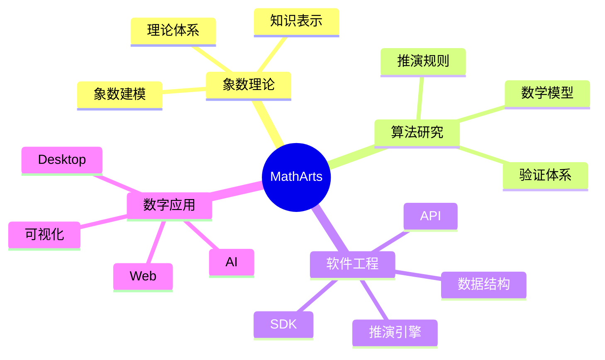

  

<h1 align="center">MathArts</h1>

<strong>用象数描述万物，用术法计算万物。</strong>

构建中国数术的数字基础设施

## 关于 MathArts

MathArts 是一个专注于中国数术数字化的开源组织。

我们希望利用现代数学、计算机科学与软件工程，研究中国传统数术的理论体系、知识结构与推演方法，并探索它们在数字时代的表达、计算与应用。

我们的目标不是简单地数字化古籍，而是建立一套开放、统一、可验证、可持续发展的中国数术数字基础设施。

## 我们认为

中国数术不仅是传统文化的一部分，也是一种关于世界、时间、关系与变化的知识系统。

MathArts 希望以现代计算方法重新组织这些知识，使其能够被表达、建模、计算、验证，并持续演进。

## 为什么存在

数千年来，中国数术积累了丰富的理论体系与实践经验。

然而，这些知识长期散落于典籍、注疏、流派与实践之中，缺乏统一的数据模型、算法表达与工程实现。

MathArts 希望让这些知识能够：

- 被表达
- 被建模
- 被计算
- 被验证
- 被复用

让传统智慧真正进入数字时代。

## 当前研究方向

## 愿景

MathArts 希望推动中国数术：

- 从典籍走向知识。
- 从知识走向模型。
- 从模型走向算法。
- 从算法走向软件。
- 从软件走向数字基础设施。

<strong>让中国数术拥有现代数字化表达。</strong>

