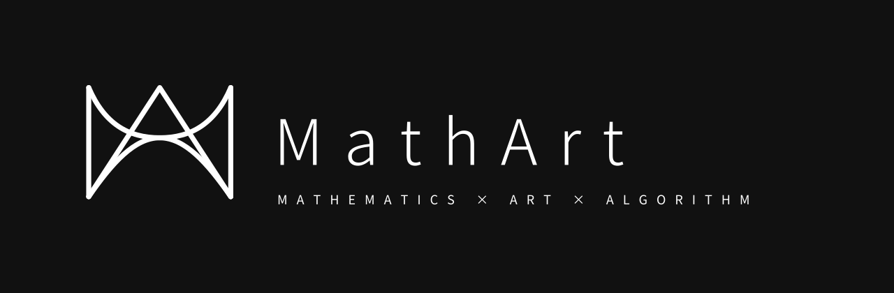
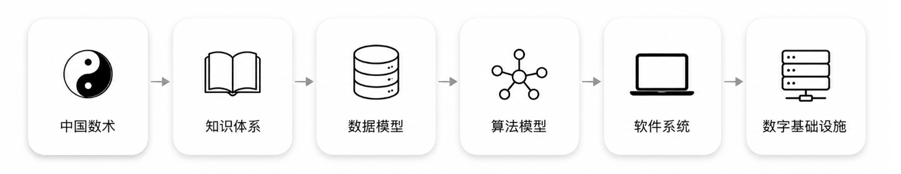
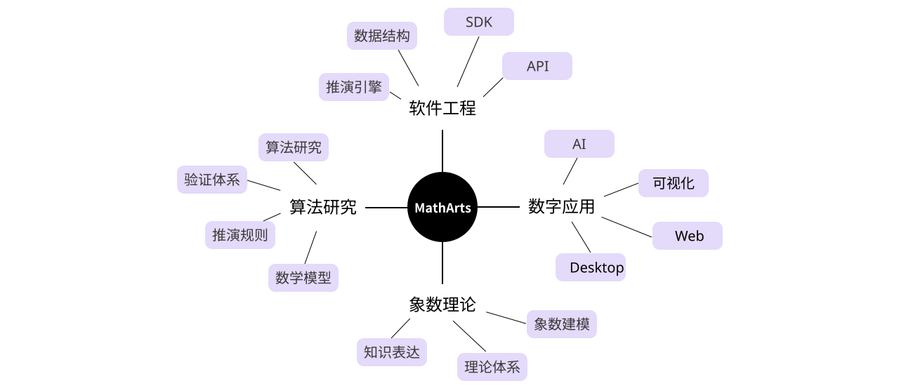

  

<h1 align="center">MathArts</h1>

  <strong>用象数描述万物，用术法计算万物。</strong>

  以现代数学、计算机科学与软件工程，构建中国数术的数字基础设施。

  <a href="https://github.com/orgs/matharts/repositories">🔭 项目</a> ·
  <a href="https://github.com/orgs/matharts/discussions">💬 讨论</a> ·
  <a href="#愿景">🌌 愿景</a> ·
  <a href="#参与共建">🤝 参与</a>

 

## 关于 MathArts

MathArts 是一个专注于**中国数术数字化**的开源组织。

我们希望利用现代数学、计算机科学与软件工程，研究中国传统数术的理论体系、知识结构与推演方法，并探索它们在数字时代的表达、计算与应用。

我们的目标不是简单地数字化古籍，而是建立一套**开放、统一、可验证、可持续演进**的中国数术数字基础设施。

## 我们认为

中国数术不仅是传统文化的一部分，更是一种关于**世界、时间、关系与变化**的知识系统。

MathArts 希望以现代计算方法重新组织这些知识，使其不再依赖经验与师承的口耳相传，而能够被清晰地表达、建模、计算、验证，并持续演进。

## 为什么存在

数千年来，中国数术积累了丰富的理论体系与实践经验。然而，这些知识长期散落于典籍、注疏、流派与实践之中，缺乏统一的数据模型、算法表达与工程实现——难以被验证，也难以被传承与复用。

MathArts 希望让这些知识能够：

- **被表达** — 以规范的术语与结构记录下来
- **被建模** — 转化为清晰、统一的数据模型
- **被计算** — 由算法可靠且可复现地推演
- **被验证** — 推演过程与结果可检验
- **被复用** — 沉淀为可调用、可组合的基础能力

让传统智慧真正进入数字时代。

## 研究方向

## 愿景

我们希望有一天——

- 📖 **数术知识有了统一的表达标准。** 散落于各家典籍与流派的概念、术语与规则，被规范地记录下来，不再彼此割裂。
- 🧮 **每一次推演都可计算、可复现。** 同样的输入得到同样的结果，过程清晰可查，而非依赖经验与口传。
- 🔍 **理论与结论能够被验证。** 数术不再止于"信与不信"，而是可被检验、讨论、修正的知识体系。
- 🧩 **任何人都能调用数术能力。** 开发者通过开放的 SDK 与 API，把数术能力嵌入自己的应用。
- 🌐 **传统智慧融入数字生活。** 借助 AI 与可视化，古老的术法以现代的方式被理解、被使用、被传承。

## 参与共建

MathArts 仍在早期阶段，欢迎任何形式的参与——无论你是数术研究者、工程师，还是单纯感兴趣的人。

- 🔭 浏览我们的[项目仓库](https://github.com/orgs/matharts/repositories)，了解正在进行的工作
- 💬 在 [Discussions](https://github.com/orgs/matharts/discussions) 中参与理论探讨与方案讨论
- 🐛 提交 Issue，反馈问题、提出想法
- 🔧 发起 Pull Request，参与代码与文档建设
- ⭐ 如果认同我们在做的事，关注并 Star 感兴趣的仓库

 

  <strong>让中国数术拥有现代数字化表达。</strong>

